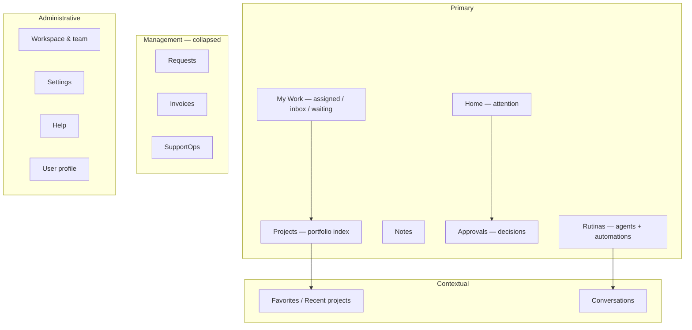

# Target information architecture

## Primary destinations

1. **Home** — attention only (approvals, blocked, at-risk, due, quiet healthy, recent agent activity).
2. **My Work** — Assigned / Inbox / Waiting; List|Board via existing WorkItemsCenter.
3. **Projects** — portfolio (former Command Center); sidebar tree for favorites/recent.
4. **Notes** — capture and writing.
5. **Approvals** — outstanding decisions badge.
6. **Rutinas** — single AI noun for routines / agents map (`/rutinas`; `/agents` aliases).

## Management (collapsed)

Requests · Invoices · SupportOps — ops destinations that are not daily essentials.

## Removed as product concepts

- **More** (submenu eliminated)
- **Command Center** as a nav noun (becomes Projects view label)
- **Work** as primary noun (becomes My Work + Projects)
- Odysseus unique hire card as a peer of primary nav (lives under Rutinas / Agents)
- Mid-rail **New conversation** card (lives as + on Conversations)

## Administrative (bottom)

Workspace & team · Settings · Help · Profile
