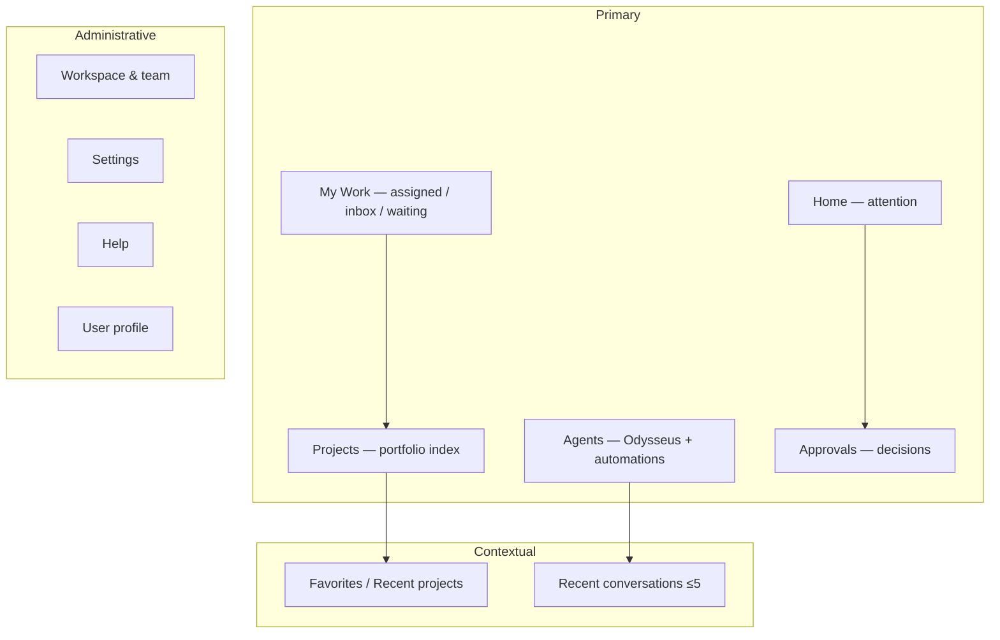

# Target information architecture

## Primary destinations

1. **Home** — attention only (approvals, blocked, at-risk, due, quiet healthy, recent agent activity).
2. **My Work** — Assigned / Inbox / Waiting; List|Board via existing WorkItemsCenter.
3. **Projects** — portfolio (former Command Center); sidebar tree for favorites/recent.
4. **Agents** — Odysseus default agent + Automations (skills/schedules); activity/updates.
5. **Approvals** — outstanding decisions badge.

## Removed as product concepts

- **More** (submenu eliminated)
- **Command Center** as a nav noun (becomes Projects view label)
- **Work** as primary noun (becomes My Work + Projects)
- Odysseus unique hire card as a peer of primary nav (lives under Agents)

## Administrative (bottom)

Workspace & team · Settings · Help · Profile
